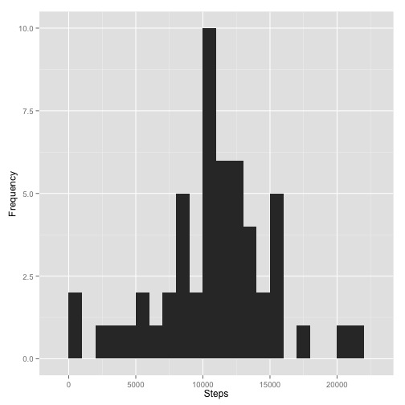
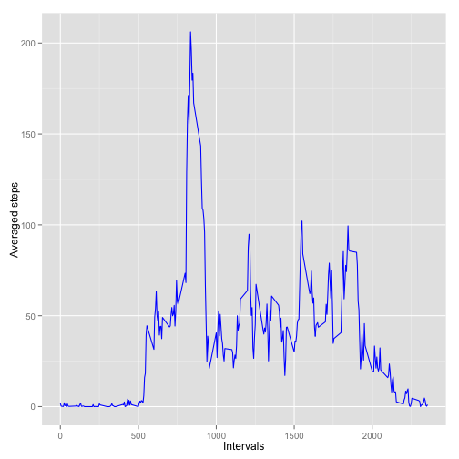
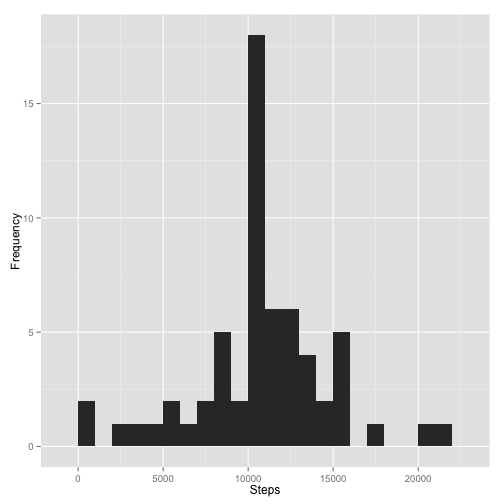
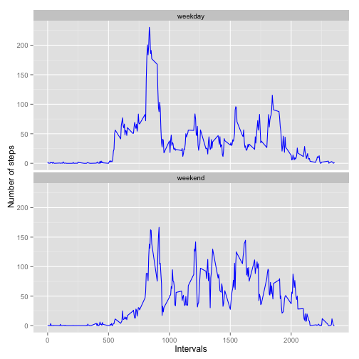

---
output:
  html_document:
    keep_md: yes
---

# Reproducible Research: Peer Assessment 1

##Introduction##
It is now possible to collect a large amount of data about personal movement using activity monitoring devices such as a Fitbit, Nike Fuelband, or Jawbone Up. These type of devices are part of the “quantified self” movement – a group of enthusiasts who take measurements about themselves regularly to improve their health, to find patterns in their behavior, or because they are tech geeks. But these data remain under-utilized both because the raw data are hard to obtain and there is a lack of statistical methods and software for processing and interpreting the data.

This assignment makes use of data from a personal activity monitoring device. This device collects data at 5 minute intervals through out the day. The data consists of two months of data from an anonymous individual collected during the months of October and November, 2012 and include the number of steps taken in 5 minute intervals each day. 

##Data##
The data for this assignment can be downloaded from the [course web site](https://d396qusza40orc.cloudfront.net/repdata%2Fdata%2Factivity.zip). The variables included in this dataset are:

- steps: Number of steps taking in a 5-minute interval (missing values are coded as NA)

- date: The date on which the measurement was taken in YYYY-MM-DD format

- interval: Identifier for the 5-minute interval in which measurement was taken

The dataset is stored in a comma-separated-value (CSV) file and there are a total of 17,568 observations in this dataset.

In the following, we will explore some basic properties of the activity data. 

## Loading and preprocessing the data
First we load the dataset using *read.csv* function in R.

```r
unzip(zipfile="activity.zip")
activity_data<-read.csv("activity.csv",na.strings="NA")
```

## What is mean total number of steps taken per day?

```r
require(ggplot2)
steps_by_date<-aggregate(steps~date, data=activity_data,FUN=sum,na.rm=TRUE)
qplot(steps_by_date$steps,binwidth=1000)+labs(x="Steps",y="Frequency")
```

 

```r
mean_steps<-as.integer(round(mean(steps_by_date$steps),digits=0))
mean_steps
```

```
## [1] 10766
```

```r
median_steps<-as.integer(round(median(steps_by_date$steps),digits=0))
median_steps
```

```
## [1] 10765
```
The mean steps per day is about **10766** and the median is about **10765**.

## What is the average daily activity pattern?

```r
avgsteps_by_intv<-aggregate(steps~interval, data=activity_data,FUN=mean,na.rm=TRUE)
ggplot(avgsteps_by_intv,aes(interval,steps))+geom_line(color="blue")+labs(x="Intervals",y="Averaged steps")
```

 

```r
max_intv<-avgsteps_by_intv[which.max(avgsteps_by_intv$steps),]$interval
max_intv
```

```
## [1] 835
```
According to above analysis, the **835th** interval contains the maximum number of steps.

## Imputing missing values

```r
sum_na<-sum(is.na(activity_data))
sum_na
```

```
## [1] 2304
```
We observed that there are lots of missing data in the dataset and the number of NA in the dataset is **2304**. In the following we will replace the missing step values(NA) by the averaged number of steps for the corresponding interval accross all days.

```r
intv_avg<-aggregate(steps~interval,data=activity_data,FUN=mean,na.rm=TRUE)
impute_data<-merge(activity_data,intv_avg,by="interval")
impute_data<-transform(impute_data,steps.x=ifelse(is.na(steps.x), steps.y, steps.x))
impute_data<-subset(impute_data,select=-steps.y)
names(impute_data)[names(impute_data)=="steps.x"]<-"steps"
```
Now the new dataset is stored in the *impute_data* variable. We repeat the above analysis with the imputed data and compute the total number of steps taken per day. The following plot shows the new histogram.


```r
impute_steps_by_date<-aggregate(steps~date, data=impute_data,FUN=sum,na.rm=TRUE)
qplot(impute_steps_by_date$steps,binwidth=1000)+labs(x="Steps",y="Frequency")
```

 

Similarly, we compute the mean and median of the total number of steps per day.

```r
impute_mean_steps<-as.integer(round(mean(impute_steps_by_date$steps),digits=0))
impute_mean_steps
```

```
## [1] 10766
```

```r
impute_median_steps<-as.integer(round(median(impute_steps_by_date$steps),digits=0))
impute_median_steps
```

```
## [1] 10766
```
The mean of steps is **10766** and the median is **10766**. From above analysis we observe that compare to the original dataset the mean of total number of steps per day stays the same but the median increases a little bit with the imputed data. And compare the histogram of the original and imputed data, we find that imputing missing data especially increases the number of days which has total number of steps between 10000 and 11000. 

## Are there differences in activity patterns between weekdays and weekends?
We add a column to the imputed dataset to indicate whether a given date is a weekday or weekend day, then plot the average number of steps taken, averged across all weekdays and weekend days. 

```r
impute_data$days<-weekdays(as.POSIXlt(impute_data$date))
impute_data$weekdays<-ifelse(impute_data$days %in% c("Saturday","Sunday"),"weekend","weekday")
avg_impute_day<-aggregate(steps~interval+weekdays, data=impute_data,FUN=mean)
ggplot(avg_impute_day,aes(interval,steps))+geom_line(color="blue")+facet_wrap(~weekdays,nrow=2,ncol=1)+labs(x="Intervals",y="Number of steps")
```

 
